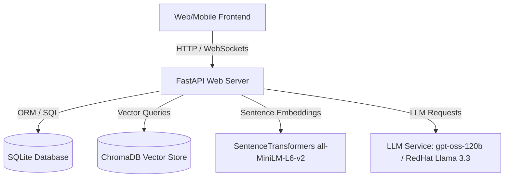

# Student System - Backend Architecture & Data Storage Documentation

This document provides a comprehensive overview of the **Student System Backend**. It explains the system architecture, how the various services interact, the detailed database schema (tables, columns, and relationships), and the workflows for major backend features.

---

## 1. System Architecture Overview

The backend is built as a modular FastAPI web application designed to support **retrieval-augmented generation (RAG) Q&A**, **adaptive learning paths**, **automated practice question generation**, and **classroom management**.



### Key Technology Stack
* **Web Framework:** FastAPI (async routing, dependency injection, automatic OpenAPI docs)
* **Relational Database (SQLAlchemy):** Support for both PostgreSQL and SQLite (default)
* **Vector Database:** ChromaDB (persistent client running locally in `./chroma_db`)
* **Embedding Model:** SentenceTransformers (`all-MiniLM-L6-v2` locally yielding 384-dimensional dense vectors)
* **Large Language Models:** Local/On-Premise OpenAI-compatible endpoints:
  * **GPT Provider:** `gpt-oss-120b` (configured via `LLM_NAME` overriding the default `gpt-4o-mini`)
  * **Llama Provider:** RedHat AI `Llama-3.3-70B-Instruct-quantized.w4a16` (via on-premise endpoint)

---

## 2. Relational Database Schema (SQLAlchemy)

The relational tables are defined across four model files and mapped via SQLAlchemy ORM.

### 2.1 Core & RAG Models ([models.py](file:///home/galaxy/Desktop/Student_System/Backend/models.py))

#### `users` Table
Stores credentials, profiles, and authorization roles.
* **`id`** (Integer, Primary Key): Unique identifier.
* **`name`** (String, Nullable): Display name.
* **`department`** (String, Nullable): Academic department.
* **`email`** (String, Unique, Indexed): User email address.
* **`password_hash`** (String): Securely hashed password.
* **`role`** (String, Default: "student"): Role restriction (`student`, `admin`, `professor`).
* **`is_active`** (Boolean, Default: True): Account status.
* **`created_at`** (DateTime): Timestamp of account creation.

#### `documents` Table
Tracks uploaded learning materials and documents.
* **`id`** (Integer, Primary Key): Unique identifier.
* **`student_id`** (ForeignKey -> `users.id`): Uploader / Owner.
* **`filename`** (String): Original filename.
* **`file_path`** (String): File system path to the storage location.
* **`file_size`** (Integer): Size in bytes.
* **`file_type`** (String): MIME type (e.g., `application/pdf`).
* **`uploaded_at`** (DateTime): Upload timestamp.
* **`readable_by`** (String, Default: "owner"): Access control (`owner`, `professor`, `all`).
* **`category`** / **`subject`** / **`title`** (String, Nullable): Metadata attributes.
* **`pages`** (Integer): Document page count.
* **`document_format`** (String): File extension format (PDF, DOC, TXT).
* **`document_type`** (String): Content category (resume, marksheet, notes, syllabus, etc.).
* **`owner_role`** (String): Role of the owner (`student` or `institution`).
* **`visibility`** (String): Visibility level (`private` or `institution`).
* **`tags_json`** (String): Serialized JSON array of descriptive tags.
* **`classroom_id`** (Integer, Nullable): Classroom association if shared.

#### `document_chunks` Table
Stores plaintext segments of documents as a fallback/mirror to the ChromaDB vector store.
* **`id`** (Integer, Primary Key): Unique identifier.
* **`document_id`** (ForeignKey -> `documents.id`): Source document.
* **`chunk_text`** (Text): The raw text segment.
* **`chunk_index`** (Integer): Ordering index.
* **`embedding`** (Text, Nullable): Serialized JSON string of the embedding vector.

#### `chat_messages` Table
Maintains historical conversation context (memory) for RAG chats.
* **`id`** (Integer, Primary Key): Unique identifier.
* **`student_id`** (ForeignKey -> `users.id`): Student interacting.
* **`role`** (String): Message source (`user` or `assistant`).
* **`content`** (Text): Plaintext message content.
* **`session_id`** (String, Indexed): Groups messages into distinct chat threads.
* **`session_title`** (String, Nullable): Generated title for the chat thread.
* **`created_at`** (DateTime): Timestamp of the message.

---

### 2.2 Adaptive Learning Engine Models ([practice_models.py](file:///home/galaxy/Desktop/Student_System/Backend/practice_models.py))

#### `practice_sessions` Table
Groups attempts on quizzes and practice modules.
* **`id`** (Integer, Primary Key)
* **`student_id`** (ForeignKey -> `users.id`)
* **`mode`** (String): Learning strategy (`topic`, `weakness`, `exam`, `revision`).
* **`topic`** (String, Nullable): Topic name (null for mixed exams).
* **`difficulty`** (String): Session target difficulty (`easy`, `medium`, `hard`, `mixed`).
* **`question_count`** (Integer): Number of questions.
* **`correct_answers`** (Integer): Student's score.
* **`accuracy`** (Float): Percentage score.
* **`created_at`** / **`ended_at`** (DateTime)
* **`is_active`** (Boolean): Active state of the session.

#### `practice_questions` Table
Individual generated questions belonging to a practice session.
* **`id`** (Integer, Primary Key)
* **`session_id`** (ForeignKey -> `practice_sessions.id`)
* **`topic`** / **`subtopic`** (String)
* **`difficulty`** (String)
* **`question_text`** (Text)
* **`options`** (JSON): Choice array formatted as `[{"id": "A", "text": "..."}, ...]`.
* **`correct_answer`** (String): e.g., `"A"`, `"B"`, `"C"`, or `"D"`.
* **`explanation`** (Text): Explanation of the correct choice.
* **`student_answer`** (String, Nullable): The answer chosen by the student.
* **`is_correct`** (Boolean, Nullable): Success flag.
* **`time_spent_seconds`** (Integer, Nullable): Time spent answering.
* **`answered_at`** (DateTime, Nullable)

#### `topic_performance` Table
Aggregated stats per topic to feed the recommendation engine.
* **`student_id`** (ForeignKey -> `users.id`)
* **`subject`** / **`topic`** (String)
* **`sessions`** (Integer): Count of sessions attempted.
* **`questions_attempted`** / **`correct_answers`** (Integer)
* **`accuracy`** (Float): Percentage performance.
* **`current_difficulty`** (String): Calibrated skill tier (`easy`, `medium`, `hard`).
* **`status`** (String): Overall grade (`STRONG`, `LEARNING`, `WEAK`, `NOT_STARTED`).
* **`last_practiced_at`** (DateTime)

#### `behavioral_insights` Table
Stores AI-detected error patterns and cognitive profiles.
* **`student_id`** (ForeignKey -> `users.id`)
* **`insight_type`** (String): e.g., `guessing`, `time_pressure`, `conceptual_gap`, `formula_misuse`, `repeated_error`.
* **`title`** (String)
* **`description`** (Text)
* **`frequency`** (Integer): Number of times this behavior was identified.

#### `user_performance` Table
High-level gamification stats (streaks, total points, badges).
* **`student_id`** (ForeignKey -> `users.id`, Unique)
* **`total_questions_attempted`** / **`total_correct_answers`** (Integer)
* **`lifetime_accuracy`** (Float)
* **`total_points`** (Integer): Awarded points (10 per correct answer).
* **`current_streak`** / **`longest_streak`** (Integer): Consecutive active days.
* **`badges_earned`** (Integer)

#### `learning_content` Table
Cached LLM-generated explanations and study material.
* **`student_id`** (ForeignKey -> `users.id`)
* **`subject`** / **`topic`** (String)
* **`content`** (JSON): Cached notes.
* **`revision`** (JSON): Revision briefs.

---

### 2.3 Personalized Roadmap Models ([roadmap_models.py](file:///home/galaxy/Desktop/Student_System/Backend/roadmap_models.py))

#### `user_goals` Table
High-level objectives selected by the student.
* **`id`** (Integer, Primary Key)
* **`student_id`** (ForeignKey -> `users.id`)
* **`goal_type`** (String): e.g., `semester_exam`, `internship`, `weak_subject`.
* **`title`** / **`description`** (String/Text)
* **`deadline`** (DateTime)
* **`status`** (String): `active`, `completed`, `abandoned`.

#### `learning_roadmaps` Table
The concrete plan corresponding to a user goal.
* **`id`** (Integer, Primary Key)
* **`student_id`** (ForeignKey -> `users.id`)
* **`goal_id`** (ForeignKey -> `user_goals.id`)
* **`title`** (String)
* **`overall_progress`** (Float): Completed task ratio.
* **`roadmap_data`** (JSON): The structural JSON representing weeks and subtopics.

#### `daily_tasks` Table
The daily sub-tasks derived from the learning roadmap.
* **`id`** (Integer, Primary Key)
* **`roadmap_id`** (ForeignKey -> `learning_roadmaps.id`)
* **`task_type`** (String): `learning` or `quiz`.
* **`topic`** (String)
* **`description`** (Text)
* **`status`** (String): `pending`, `completed`.
* **`assigned_date`** (DateTime)
* **`week_number`** / **`day_number`** (Integer): Timing indices.
* **`subtopics`** (JSON): Array of detailed subtopics.

---

### 2.4 Classroom Models ([classroom_models.py](file:///home/galaxy/Desktop/Student_System/Backend/classroom_models.py))

#### `classrooms` Table
Organizes classrooms created by professors.
* **`id`** (Integer, Primary Key)
* **`name`** (String): Classroom name.
* **`code`** (String, Unique): Registration invite code.
* **`professor_id`** (ForeignKey -> `users.id`): Class owner.

#### `student_classes` Table
Many-to-many junction table for student enrollment.
* **`student_id`** (ForeignKey -> `users.id`)
* **`class_id`** (ForeignKey -> `classrooms.id`)

#### `class_resources` Table
Files uploaded directly to a classroom by professors.
* **`class_id`** (ForeignKey -> `classrooms.id`)
* **`title`** (String)
* **`type`** (String): Category of resource (`syllabus`, `notes`, `assignment`, `pyq`).
* **`file_path`** (String): File system path.
* **`uploaded_by`** (ForeignKey -> `users.id`)

#### `class_curriculums` Table
Syllabus metadata and curriculum structure parsed from syllabus uploads.
* **`class_id`** (ForeignKey -> `classrooms.id`, Unique)
* **`subject_name`** (String)
* **`extracted_text`** (String): Parsed PDF text.
* **`curriculum_json`** (JSON): Structured semesters, courses, and topics.

---

## 3. Vector Database (ChromaDB) Storage

For semantic document search, the system uses a local vector store.

* **DB Engine:** ChromaDB (`chromadb.PersistentClient` pointing to `./chroma_db`).
* **Target Collection:** `document_chunks`.
* **Dimension Mapping:** Generated using `SentenceTransformer("all-MiniLM-L6-v2")` which yields 384 dimensions.

```
ChromaDB Record Struct:
├── ID: "{document_id}_{chunk_index}"
├── Document Content: Raw plaintext chunk (approx. 1000 characters)
├── Embeddings Vector: [0.143, -0.092, ..., 0.005] (384 float vector)
└── Metadata: {"document_id": int, "chunk_index": int}
```

---

## 4. Key Workflows Explained

### 4.1 Document Ingestion & RAG Pipeline

When a document is uploaded, the following workflow occurs:
1. **File Check & Save:** The file is saved to the `./uploads` directory.
2. **Text Extraction (`services/extract.py`):** The system extracts plaintext from files (PDFs, DOCX, TXT).
3. **Text Chunking (`services/chunk.py`):** The text is split into semantic blocks of a fixed character length with overlaps.
4. **Vector Embedding:** Each chunk is passed through the `SentenceTransformer` model to generate its 384-dimensional dense vector representation.
5. **ChromaDB Upsert:** Chunks are saved to ChromaDB with the metadata dictionary containing the source `document_id`.
6. **Relational Sync:** Chunks are mirrored in the `document_chunks` table for quick SQL checks.

#### Query Time (Semantic Search)
1. The user asks a question.
2. The query is converted into an embedding using the same `SentenceTransformer` model.
3. The embedding is queried against ChromaDB, applying metadata filters to restrict search results to the student's authorized documents (`allowed_doc_ids`).
4. The top $K$ relevant chunks are retrieved, combined with chat history, and formatted into an LLM prompt.
5. The LLM processes the prompt and returns a response grounded in the uploaded documents.

---

### 4.2 Adaptive Practice & Learning Loop

1. **Calibration:** The recommendation engine reviews a student's accuracy in `topic_performance`.
2. **Generation:** When a student starts a practice session, the system queries the **LLM Client** to generate questions tailored to the student's current proficiency level (`easy`, `medium`, or `hard`).
3. **Adaptive Recalibration:**
   * If a student demonstrates high accuracy (e.g., $>75\%$) in a practice session, the system elevates their `current_difficulty` rating.
   * If accuracy falls below $55\%$, the difficulty is downgraded, and the topic status changes to `WEAK`.
4. **Behavioral Analysis:** A worker parses incorrect options selected by the student. If a pattern emerges (e.g., answering in under 3 seconds represents `guessing`), it inserts a corresponding entry into the `behavioral_insights` table.

---

## 5. Configuration & Environment Setup

The application behavior is driven by a `.env` configuration file loaded via `config.py`:

| Parameter | Type | Purpose |
| :--- | :--- | :--- |
| `DATABASE_URL` | String | Database connection string (e.g. `postgresql://...` or `sqlite:///...`) |
| `DEFAULT_LLM_PROVIDER` | String | Primary model provider (`gpt4o` or `llama`) |
| `OPENAI_API_BASE_URL` | String | Custom base URL for the GPT provider (e.g. `http://192.168.10.65:8010/v1`) |
| `OPENAI_API_KEY` | String | API key or token for the GPT provider |
| `LLM_NAME` | String | Active model identifier for the GPT provider (e.g. `gpt-oss-120b`) |
| `REDHATAI_BASE_URL` | String | API base URL for the local/on-premise Llama model endpoint |
| `REDHATAI_API_KEY` | String | API key or token for the Llama provider |
| `SECRET_KEY` | String | Cryptographic key used to sign JWT auth tokens |
| `UPLOAD_DIR` | String | File system path where documents are stored |

---

## 6. Directory Structure & File Mapping

Here is the breakdown of the backend directory structure, mapping each file to its core responsibility and explaining how they work together.

### 6.1 Root Files

* **[main.py](file:///home/galaxy/Desktop/Student_System/Backend/main.py):** The entry point of the FastAPI application. It initializes middleware (CORS, trusted hosts), sets up startup/shutdown events, configures database tables via `init_db()`, mounts the uploads directory, and registers API routers for all routes.
* **[database.py](file:///home/galaxy/Desktop/Student_System/Backend/database.py):** Configures the SQLAlchemy database engine, session makers, and declarative base. It runs schema-level migrations on start, enables WAL mode for SQLite, and contains code to seed dummy student metrics if the DB is empty.
* **[config.py](file:///home/galaxy/Desktop/Student_System/Backend/config.py):** Parses and validates environment variables from `.env`. Sets up paths, constraints, and configuration metrics for the LLMs.
* **[chroma_store.py](file:///home/galaxy/Desktop/Student_System/Backend/chroma_store.py):** Exposes interfaces to connect with ChromaDB. Handles document chunk insertions, deletions, metadata-filtered queries, and monkey-patches ChromaDB to prevent SQLite seq ID issues.
* **[models.py](file:///home/galaxy/Desktop/Student_System/Backend/models.py):** Holds definitions for core database tables: users, files/documents, plaintext chunk backups, and chat histories.
* **[practice_models.py](file:///home/galaxy/Desktop/Student_System/Backend/practice_models.py):** Declares models tracking practice metrics, generated questions, cumulative topic scores, AI-driven behavioral feedback, and gamified streak counters.
* **[roadmap_models.py](file:///home/galaxy/Desktop/Student_System/Backend/roadmap_models.py):** Represents roadmap schedules: goals, weekly layout outlines, and individual task checklists.
* **[classroom_models.py](file:///home/galaxy/Desktop/Student_System/Backend/classroom_models.py):** Handles structural entities of a class: classrooms, enrollments, shared study resources, and curricula parsed from syllabus uploads.

---

### 6.2 Routes Directory (`routes/`)

Each route file registers a router with `main.py` to handle specialized API endpoints:

* **[auth.py](file:///home/galaxy/Desktop/Student_System/Backend/routes/auth.py):** Manages user registration, JWT generation, secure login, password hash verification, and route session security.
* **[upload.py](file:///home/galaxy/Desktop/Student_System/Backend/routes/upload.py) & [documents.py](file:///home/galaxy/Desktop/Student_System/Backend/routes/documents.py):** Receives file uploads, stores them on disk, coordinates with extraction services, indexes chunks into ChromaDB, and lists/deletes cataloged documents.
* **[chat.py](file:///home/galaxy/Desktop/Student_System/Backend/routes/chat.py) & [chat_sidebar.py](file:///home/galaxy/Desktop/Student_System/Backend/routes/chat_sidebar.py):** Interfaces with Chat sessions. Performs vector searches, constructs LLM payloads, generates streaming answers, and manages chat sidebar folders/sessions.
* **[classroom.py](file:///home/galaxy/Desktop/Student_System/Backend/routes/classroom.py) & [professor.py](file:///home/galaxy/Desktop/Student_System/Backend/routes/professor.py):** Exposes student APIs (joining classes, retrieving shared resources) and professor dashboards (managing assignments, parsing syllabus documents, and monitoring student analytics).
* **[roadmap.py](file:///home/galaxy/Desktop/Student_System/Backend/routes/roadmap.py):** Manages learning roadmaps: goal configuration, progress monitoring, daily tasks list, and customization preferences.
* **[practice.py](file:///home/galaxy/Desktop/Student_System/Backend/routes/practice.py) & [performance.py](file:///home/galaxy/Desktop/Student_System/Backend/routes/performance.py):** APIs for adaptive quizzes, question submission scoring, strengths/weaknesses profiling, and retrieving badges and activity analytics.
* **[career.py](file:///home/galaxy/Desktop/Student_System/Backend/routes/career.py):** Resume analyzing engines and job market trajectory recommendations.
* **[settings.py](file:///home/galaxy/Desktop/Student_System/Backend/routes/settings.py):** Switches LLM providers and user preferences in memory.

---

### 6.3 Services Directory (`services/`)

Contains core business logic modules detached from the API protocol layer:

#### Core Services & RAG Orchestration
* **[llm_client.py](file:///home/galaxy/Desktop/Student_System/Backend/services/llm_client.py):** Manages communication with OpenAI and RedHat Llama servers. Handles system prompts, chat history concatenation, tokens configuration, streaming yields, and provider fallback rules.
* **[embedding.py](file:///home/galaxy/Desktop/Student_System/Backend/services/embedding.py):** Generates 384-dimensional vectors using SentenceTransformers `all-MiniLM-L6-v2`.
* **[extract.py](file:///home/galaxy/Desktop/Student_System/Backend/services/extract.py):** Extractors for parsing raw text from PDF, DOCX, and TXT files.
* **[chunk.py](file:///home/galaxy/Desktop/Student_System/Backend/services/chunk.py):** Splits large extracted texts into overlapping chunks for semantic modeling.
* **[search.py](file:///home/galaxy/Desktop/Student_System/Backend/services/search.py) & [context_builder.py](file:///home/galaxy/Desktop/Student_System/Backend/services/context_builder.py):** Executes hybrid keyword/vector search against ChromaDB and formats relevant excerpts into standard LLM prompts.
* **[query_rewriter.py](file:///home/galaxy/Desktop/Student_System/Backend/services/query_rewriter.py):** Pre-processes client chat queries to rephrase and optimize them for improved vector retrieval matches.
* **[query_planner.py](file:///home/galaxy/Desktop/Student_System/Backend/services/query_planner.py):** Organizes search steps for complex, multi-concept queries.
* **[document_resolver.py](file:///home/galaxy/Desktop/Student_System/Backend/services/document_resolver.py):** Controls permission-based access limits, matching files and resources to the appropriate class enrollments and roles.

#### Chatbot Sub-service (`services/chatbot/`)
* **[chat_intent.py](file:///home/galaxy/Desktop/Student_System/Backend/services/chatbot/chat_intent.py):** Analyzes messages using prompt classification to detect user intent (e.g., standard Q&A, exam generation requests, or preference updates).
* **[chat_prompts.py](file:///home/galaxy/Desktop/Student_System/Backend/services/chatbot/chat_prompts.py):** Stores system prompt templates, formatting instructions, and persona configurations.
* **[personal_roadmap.py](file:///home/galaxy/Desktop/Student_System/Backend/services/chatbot/personal_roadmap.py):** Bridges user preferences and goals with LLM generation to formulate custom roadmap courses.

#### Adaptive Learning & Practice Sub-service (`services/practice/`)
* **[question_generator.py](file:///home/galaxy/Desktop/Student_System/Backend/services/practice/question_generator.py):** Coordinates with LLMs to synthesize topic-specific and difficulty-calibrated multiple-choice questions.
* **[session_manager.py](file:///home/galaxy/Desktop/Student_System/Backend/services/practice/session_manager.py):** Controls session life-cycles, validating student answers, saving quiz completions, and awarding game points.
* **[topic_extractor.py](file:///home/galaxy/Desktop/Student_System/Backend/services/practice/topic_extractor.py):** Scans syllabus text structure using patterns to isolate individual learning topics.
* **[content_generator.py](file:///home/galaxy/Desktop/Student_System/Backend/services/practice/content_generator.py):** Compiles detailed study notes and exam summaries based on selected topics.
* **[analytics.py](file:///home/galaxy/Desktop/Student_System/Backend/services/practice/analytics.py):** Translates raw quiz attempts into cognitive insights and highlights core strength areas.
* **[base.py](file:///home/galaxy/Desktop/Student_System/Backend/services/practice/base.py):** Declares baseline schemas, standard algorithms, and database helper functions.

#### Personalized Roadmap Sub-service (`services/roadmap/`)
* **[roadmap_engine.py](file:///home/galaxy/Desktop/Student_System/Backend/services/roadmap/roadmap_engine.py):** Assembles goals into weeks-long schedules, generating milestones, core reading topics, and task lists.

#### Analytics & Dashboard Engines
* **[recommendation_engine.py](file:///home/galaxy/Desktop/Student_System/Backend/services/recommendation_engine.py):** Analyzes topic performance to compute weak modules that the student should study next.
* **[analytics_engine.py](file:///home/galaxy/Desktop/Student_System/Backend/services/analytics_engine.py) & [homepage_engine.py](file:///home/galaxy/Desktop/Student_System/Backend/services/homepage_engine.py):** Gathers cross-module summaries (e.g. streaks, daily targets, historical accuracy) to render client dashboards.

---

## 7. How the Components Work Together

```
                  ┌────────────────────────────────────────┐
                  │                 CLIENT                 │
                  └───────────────────┬────────────────────┘
                                      │
                                      ▼
                  ┌────────────────────────────────────────┐
                  │          FastAPI (main.py)             │
                  └───────────────────┬────────────────────┘
                                      │
              ┌───────────────────────┼───────────────────────┐
              ▼                       ▼                       ▼
     [Routes (routes/*)]     [Database (database.py)] [ChromaDB (chroma_store.py)]
              │                       │                       │
              │ (SQLAlchemy ORM)      │ (Reads/Writes)        │ (Vector Index)
              ▼                       ▼                       ▼
      [Models (*_models.py)]    [SQLite/Postgres]      [Embedding (embedding.py)]
              │                                               │
              └───────────────────────┬───────────────────────┘
                                      │ (Passes Prompt/Context)
                                      ▼
                          [LLM Client (llm_client.py)]
                                      │
                                      ▼
                        [gpt-oss-120b / Llama 3.3]
```

1. **Client Interaction:** The client calls route endpoints in the `routes/` folder.
2. **Database Queries:** Routes load metadata and user details using SQLAlchemy models defined in the root directories and SQLite/Postgres connection handlers in `database.py`.
3. **Contextual Retrieval:** For AI and RAG questions, routes invoke extraction/search services (`search.py`, `context_builder.py`), query vector embeddings in `chroma_store.py` (which uses `embedding.py` internally), and load relevant contextual documents.
4. **LLM Inference:** The generated prompt is passed to `llm_client.py`, which routes the query to the correct provider (`gpt-oss-120b` or `Llama-3.3`), streaming the response back to the client.
5. **Insights & Feedback:** Student quiz submissions trigger performance metrics calculation (`practice/` and `recommendation_engine.py`), updating the database stats so that dashboard services (`homepage_engine.py`) serve updated, customized learning metrics.
